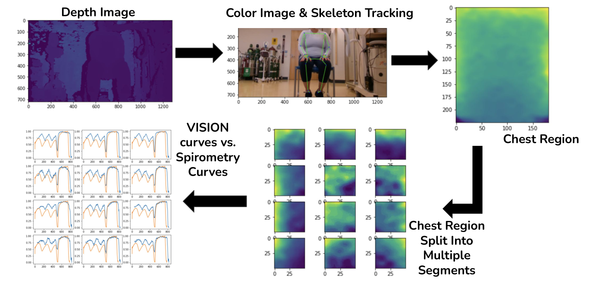
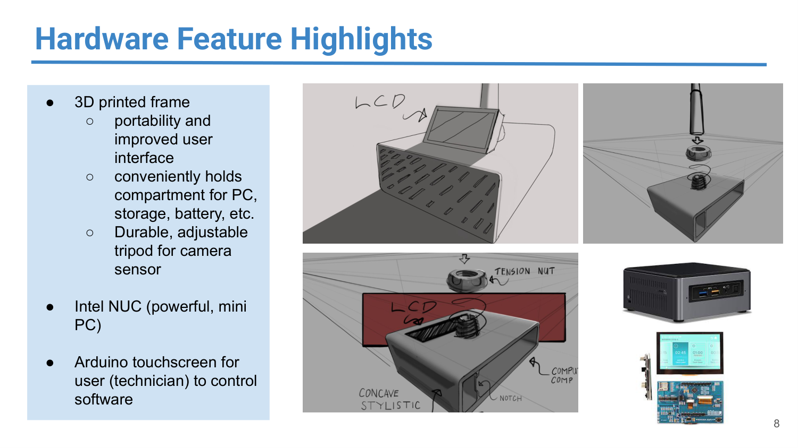
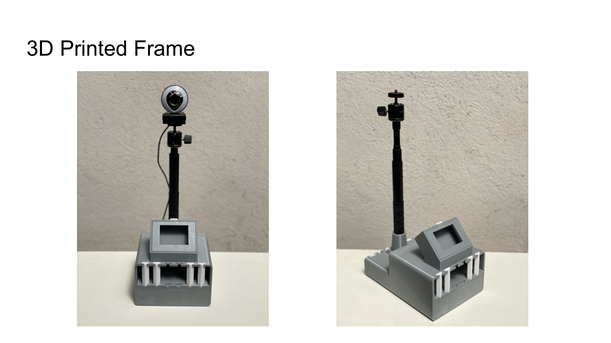
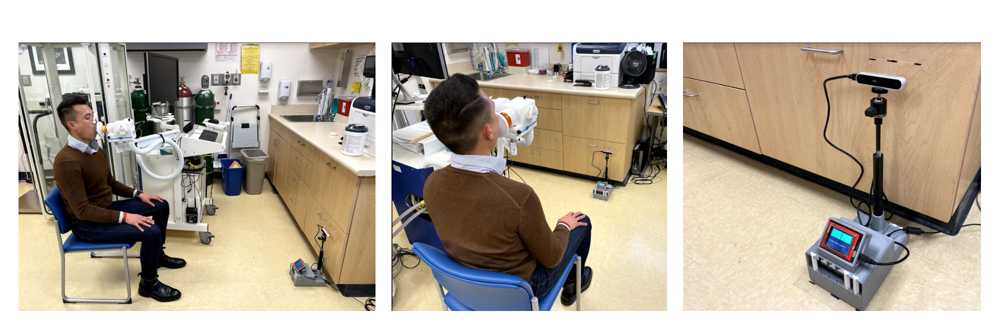

# Breathily

Breathily was a startup developing a contactless device to make **lung function assessment accessible to patients with physical disabilities** such as ALS and other neuromuscular diseases. Traditional spirometers require patients to form a tight seal around a mouthpiece and exhale forcefully — something many ALS patients cannot do due to facial muscle weakness and limited mobility. Breathily replaces the mouthpiece with **depth sensors and computer vision**, estimating lung function from chest wall movement alone.

> **Status:** Project ended 3/15/2022. This repo is an archive of the research code.

## Demo

▶️ Watch the demo: https://www.youtube.com/watch?v=MaBf3D1GvQA

### Spirometer Comparison

Side-by-side comparison of Breathily with a traditional spirometer:

<video src="https://github.com/user-attachments/assets/5c532dcd-fda9-4f38-88f9-b5619a01f09d" controls width="100%"></video>

### Clinical Lab Testing

Device testing setup at the UCSF Adult Pulmonary Function Lab, used during our IRB-approved clinical studies:

<video src="https://github.com/user-attachments/assets/3f4d1946-0624-4dc7-89a1-16791fc3686b" controls width="100%"></video>

## Recognition

- 🥈 **2nd Place**, UC Launch Accelerator Program
- 💰 Funding & support from the **UCSF Catalyst Program**
- 🔬 **NSF I-Corps** participant
- 📜 **US Patent Application** [US20240090795A1](https://patents.google.com/patent/US20240090795A1/en)

## Software Pipeline

The full processing pipeline captures depth and color data from Intel RealSense cameras, localizes the patient's chest via skeleton tracking, segments the chest region, and compares the vision-derived displacement curves against ground-truth spirometry.

1. **Depth Image** — Raw depth frame from Intel RealSense captures the patient's torso.
2. **Color Image & Skeleton Tracking** — Cubemos skeleton tracking detects body joints and localizes the chest ROI.
3. **Chest Region Extraction** — The chest depth map is isolated and segmented into multiple sub-regions for finer-grained analysis.
4. **Lung Function Computation** — Chest displacement signals from each segment are processed via peak detection and a trained regression model to compute PFT parameters (FVC, FEV1, FEV1/FVC, PEF, FEF25-75).
5. **Validation** — Vision-derived volume curves are compared against simultaneous spirometer recordings to validate accuracy.

## Hardware Design

The hardware went through an iterative design process, from initial CAD sketches to a fully 3D-printed portable frame used in clinical studies.

### Design Process

The enclosure was designed to be a self-contained, portable unit housing all components needed for a clinical measurement session:

- **3D-printed frame** — Custom enclosure for portability and improved user interface, with compartments for the PC, storage, and battery
- **Adjustable tripod mount** — Durable, height-adjustable pole with tension nut for positioning the depth camera sensor at the correct angle
- **Intel NUC** — Compact, powerful mini PC housed inside the frame for on-device processing
- **Arduino touchscreen** — Integrated display for technicians to control the software pipeline during measurements

  

<em>CAD sketches showing the enclosure design with LCD mount, tension nut mechanism, and component layout</em>

### Final 3D-Printed Device

  

<em>The final 3D-printed frame with Intel RealSense camera on adjustable tripod and integrated touchscreen</em>

## Clinical Study

Breathily ran an **IRB-approved clinical study at the UCSF Adult Pulmonary Function Lab** to validate the vision-based approach against gold-standard spirometry. The study recorded **12 patients across 61 spirometry efforts**, collecting simultaneous depth camera and spirometer data.

  

<em>Clinical study setup at the UCSF Adult Pulmonary Function Lab — patient performing spirometry (left, center) and the Breathily device with depth camera and touchscreen (right)</em>

### Study Setup

During testing, patients sat in front of the Breathily device while simultaneously performing standard spirometry on the clinical spirometer. The system ran real-time quality assessment checks — monitoring rocking movement, side movement, shoulder movement, neck movement, and leg position — to ensure valid data capture. A 3D body mesh was also reconstructed in real-time to compute waist and chest circumference measurements.

### Software Features Demonstrated in Clinical Setting

- **Real-time quality assessment** — Automated checks for patient movement and positioning (rocking, side, shoulder, neck, leg status displayed as Good/Bad)
- **3D full body mesh estimation** — Real-time computation of waist and chest circumference from depth data
- **Multi-angle recording** — Quality assessed from straight-on, low angle, and wide-angle high camera positions
- **PFT parameter computation** — FVC, FEV1, FEV1/FVC, PEF computed in real-time and compared against spirometer ground truth

## How it works

Breathily uses one or more **Intel RealSense** depth cameras pointed at a seated patient's torso. As the patient breathes, the system:

1. Detects the patient and locates the chest region using **skeleton tracking** (Cubemos).
2. Extracts a depth signal of chest wall displacement over time.
3. Identifies key respiratory phases (tidal breathing, start of exhale, end of exhale) via peak detection on the displacement curve.
4. Maps the depth-derived FVC to a calibrated lung volume using a regression model trained against ground-truth spirometry.
5. Computes standard pulmonary function test (PFT) measures: **FVC, FEV1, FEV1/FVC, PEF, FEF25, FEF50, FEF75, FEF25-75**.

## Repository layout

### [`helper_utils/`](helper_utils/) — runtime library

- [`realsense_manager.py`](helper_utils/realsense_manager.py) — `DeviceManager` class wrapping the Intel RealSense pipeline (depth + RGB streaming, alignment, post-processing filters, IR emitter control, playback from `.bag` files).
- [`skeleton_tracking.py`](helper_utils/skeleton_tracking.py) — Cubemos-based 2D/3D skeleton tracking utilities used to localize the chest ROI on the patient.
- [`patient_measurement.py`](helper_utils/patient_measurement.py) — `DeviceLungMeasure`, the top-level capture class that orchestrates a measurement session: streaming, ROI tracking, signal recording, and saving runs to disk.
- [`lung_measurement.py`](helper_utils/lung_measurement.py) — Signal processing and PFT computation. Detects respiratory keypoints, translates chest displacement to predicted lung volume via a saved regression model, and computes the full set of PFT metrics.
- [`user_control.py`](helper_utils/user_control.py) — Keyboard/UI control helpers for live capture sessions.
- [`DeviceManager.py`](helper_utils/DeviceManager.py) — placeholder.

### [`ipython_notebooks/`](ipython_notebooks/) — research & pipeline notebooks

- [`pipeline_master_v1.ipynb`](ipython_notebooks/pipeline_master_v1.ipynb) / [`pipeline_master_v2.ipynb`](ipython_notebooks/pipeline_master_v2.ipynb) — End-to-end measurement pipelines: capture → chest tracking → signal extraction → PFT computation. v2 is the latest iteration.
- [`reading_chest_vol_master.ipynb`](ipython_notebooks/reading_chest_vol_master.ipynb) — Reads recorded RealSense `.bag` files and extracts chest volume / displacement signals.
- [`compute_lung_params_master.ipynb`](ipython_notebooks/compute_lung_params_master.ipynb) — Computes PFT parameters (FVC, FEV1, PEF, FEF series) from chest displacement signals and compares against spirometer ground truth.
- [`dual_depth_vol_master.ipynb`](ipython_notebooks/dual_depth_vol_master.ipynb) — Experiments using **two depth cameras** to reconstruct chest volume more accurately than a single front-facing sensor.
- [`realtime_chest_visualization_master.ipynb`](ipython_notebooks/realtime_chest_visualization_master.ipynb) — Live visualization of the chest displacement signal during a capture session.
- [`skeleton_tracking_master.ipynb`](ipython_notebooks/skeleton_tracking_master.ipynb) — Standalone skeleton tracking development and debugging.

## Dependencies

- Python 3
- `pyrealsense2` (Intel RealSense SDK)
- Cubemos Skeleton Tracking SDK
- `numpy`, `scipy`, `pandas`, `scikit-learn`, `joblib`, `scikit-image`, `opencv-python`, `matplotlib`

## Contact

Franklin Heng — heng.franklin@gmail.com
