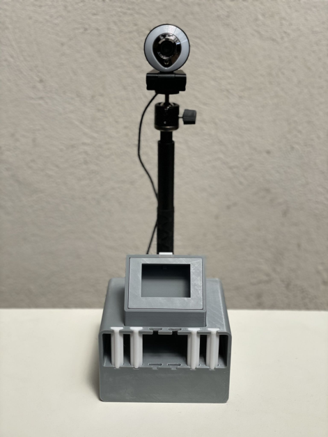
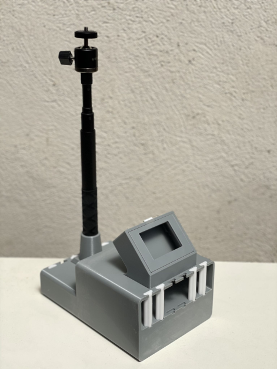
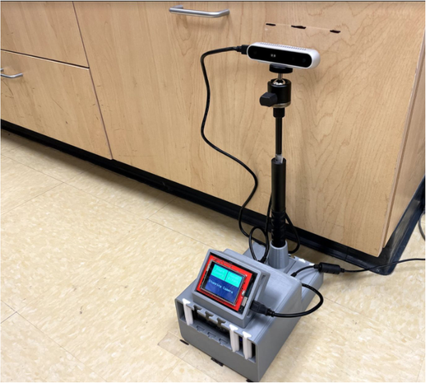
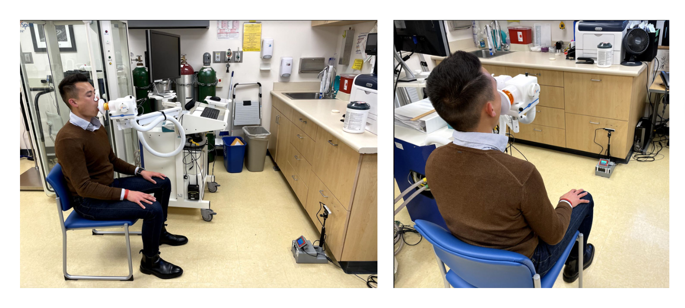

# Breathily

Breathily was a startup that developed a contactless system for lung function assessment in patients with physical disabilities, including ALS and related neuromuscular conditions. This repository contains the archived research code, utilities, and notebooks used to prototype and validate the pipeline.

<p align="center">
  
</p>

---

## Table of Contents

- [Project Status](#project-status)
- [Why This Exists](#why-this-exists)
- [Demo](#demo)
- [Recognition](#recognition)
- [Software Pipeline](#software-pipeline)
- [Hardware Design](#hardware-design)
- [Clinical Study](#clinical-study)
- [How It Works](#how-it-works)
- [Repository Layout](#repository-layout)
- [Tech Stack](#tech-stack)
- [Get In Touch](#get-in-touch)

---

## Project Status

The project ended on 3/15/2022. This repository is maintained as a technical archive of the work.

---

## Why This Exists

Conventional spirometry requires a tight mouth seal and forceful exhalation, which can be difficult for many patients with facial muscle weakness or limited mobility. Breathily was built to estimate pulmonary function from chest wall motion using depth sensing and computer vision, with no mouthpiece required.

---

## Demo

[](https://www.youtube.com/watch?v=MaBf3D1GvQA)

Demo video: https://www.youtube.com/watch?v=MaBf3D1GvQA

### Spirometer Comparison

Side by side comparison of Breathily and standard spirometry.

<video src="https://github.com/user-attachments/assets/5c532dcd-fda9-4f38-88f9-b5619a01f09d" controls width="100%"></video>

### Clinical Lab Testing

Testing setup at the UCSF Adult Pulmonary Function Lab during IRB approved studies.

<video src="https://github.com/user-attachments/assets/3f4d1946-0624-4dc7-89a1-16791fc3686b" controls width="100%"></video>

---

## Recognition

- 2nd Place, UC Launch Accelerator Program
- Funding and support from the UCSF Catalyst Program
- NSF I-Corps participant
- US Patent Application [US20240090795A1](https://patents.google.com/patent/US20240090795A1/en)

---

## Software Pipeline

The pipeline captures synchronized depth and color streams from Intel RealSense hardware, localizes the chest region with skeleton tracking, extracts motion signals, and maps those signals to pulmonary function metrics.

```text
depth and color capture
  -> skeleton tracking and chest localization
  -> chest region segmentation
  -> displacement signal extraction
  -> peak based respiratory phase detection
  -> regression based PFT estimation
  -> comparison against spirometer ground truth
```

Pipeline stages:

1. Depth image capture of the torso.
2. Skeleton joint detection and chest ROI localization.
3. Chest depth map segmentation into sub regions.
4. Time series processing and model based prediction of FVC, FEV1, FEV1/FVC, PEF, and FEF25-75.
5. Validation against concurrent spirometer curves.

---

## Hardware Design

The hardware progressed from CAD sketches to a portable 3D printed enclosure used in clinical sessions.

Design goals:

- Portable frame for field and lab use.
- Adjustable sensor positioning for patient alignment.
- On device compute through Intel NUC hardware.
- Integrated touchscreen control for operators.

<p align="center">
  
</p>
<p align="center"><sub><b>CAD design</b>: enclosure sketch with LCD mount, tension nut mechanism, and component layout.</sub></p>

### Final Device

<table align="center">
  <tr>
    <td align="center" valign="middle"></td>
    <td align="center" valign="middle"></td>
    <td align="center" valign="middle"></td>
  </tr>
  <tr>
    <td align="center" valign="top"><sub><b>Front</b>: frame and mounting geometry.</sub></td>
    <td align="center" valign="top"><sub><b>Side</b>: tripod alignment and sensor position.</sub></td>
    <td align="center" valign="top"><sub><b>Setup</b>: full system with touchscreen and camera.</sub></td>
  </tr>
</table>

---

## Clinical Study

Breathily was evaluated in an IRB approved clinical study at the UCSF Adult Pulmonary Function Lab with simultaneous depth capture and spirometry.

<p align="center">
  
</p>
<p align="center"><sub><b>Clinical setup</b>: patient spirometry and concurrent rear view of the Breathily capture system.</sub></p>

### Study Setup

Patients sat in front of the Breathily device while performing standard spirometry. The software monitored movement quality indicators, including rocking, side movement, shoulder movement, neck movement, and leg position. A real time body mesh was also reconstructed to estimate waist and chest circumference.

### Clinical Features Demonstrated

- Real time quality checks for movement and posture.
- 3D full body mesh estimation for circumference measurements.
- Multi angle quality assessment from multiple camera viewpoints.
- Real time PFT estimation with direct comparison to spirometer output.

---

## How It Works

Breathily uses one or more Intel RealSense depth sensors pointed at a seated patient.

```text
patient breathes naturally
  -> chest motion recorded as depth displacement
  -> respiratory keypoints detected from peaks and troughs
  -> displacement mapped to calibrated volume estimate
  -> pulmonary function metrics reported
```

Reported metrics include FVC, FEV1, FEV1/FVC, PEF, FEF25, FEF50, FEF75, and FEF25-75.

---

## Repository Layout

```text
.
├── README.md
├── SKILLS.md
├── helper_utils/
│   ├── __init__.py
│   ├── DeviceManager.py
│   ├── lung_measurement.py
│   ├── patient_measurement.py
│   ├── realsense_manager.py
│   ├── skeleton_tracking.py
│   └── user_control.py
├── ipython_notebooks/
│   ├── compute_lung_params_master.ipynb
│   ├── dual_depth_vol_master.ipynb
│   ├── pipeline_master_v1.ipynb
│   ├── pipeline_master_v2.ipynb
│   ├── reading_chest_vol_master.ipynb
│   ├── realtime_chest_visualization_master.ipynb
│   └── skeleton_tracking_master.ipynb
└── media/
```

### Runtime Library

- [helper_utils/realsense_manager.py](helper_utils/realsense_manager.py): RealSense streaming, alignment, filtering, IR control, and playback utilities.
- [helper_utils/skeleton_tracking.py](helper_utils/skeleton_tracking.py): Cubemos based 2D and 3D skeleton localization helpers.
- [helper_utils/patient_measurement.py](helper_utils/patient_measurement.py): Session orchestration for capture, ROI tracking, and data export.
- [helper_utils/lung_measurement.py](helper_utils/lung_measurement.py): Signal processing and pulmonary function parameter computation.
- [helper_utils/user_control.py](helper_utils/user_control.py): Keyboard and interface controls for live sessions.
- [helper_utils/DeviceManager.py](helper_utils/DeviceManager.py): Placeholder module.

### Notebooks

| File | Purpose |
|---|---|
| [ipython_notebooks/pipeline_master_v1.ipynb](ipython_notebooks/pipeline_master_v1.ipynb) | End to end measurement pipeline prototype. |
| [ipython_notebooks/pipeline_master_v2.ipynb](ipython_notebooks/pipeline_master_v2.ipynb) | Latest end to end pipeline iteration. |
| [ipython_notebooks/reading_chest_vol_master.ipynb](ipython_notebooks/reading_chest_vol_master.ipynb) | Extracts chest volume and displacement from recorded RealSense .bag data. |
| [ipython_notebooks/compute_lung_params_master.ipynb](ipython_notebooks/compute_lung_params_master.ipynb) | Computes PFT parameters and compares outputs to spirometer references. |
| [ipython_notebooks/dual_depth_vol_master.ipynb](ipython_notebooks/dual_depth_vol_master.ipynb) | Evaluates two camera depth reconstruction for improved chest volume estimation. |
| [ipython_notebooks/realtime_chest_visualization_master.ipynb](ipython_notebooks/realtime_chest_visualization_master.ipynb) | Real time visualization of chest displacement during capture. |
| [ipython_notebooks/skeleton_tracking_master.ipynb](ipython_notebooks/skeleton_tracking_master.ipynb) | Standalone skeleton tracking development and debugging notebook. |

---

## Tech Stack

- Python 3
- Intel RealSense SDK through pyrealsense2
- Cubemos Skeleton Tracking SDK
- NumPy, SciPy, pandas, scikit-learn, joblib, scikit-image, OpenCV, Matplotlib

---

## Get In Touch

For questions: [heng.franklin@gmail.com](mailto:heng.franklin@gmail.com)
